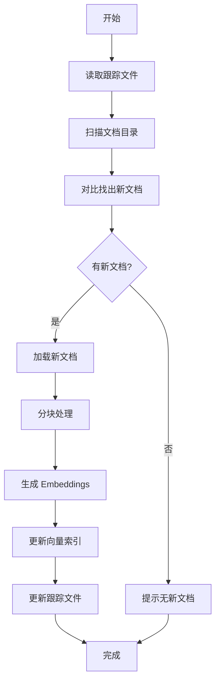

# 📚 智能索引更新指南

## 目录

- [概述](#概述)
- [核心功能](#核心功能)
- [快速开始](#快速开始)
- [详细使用](#详细使用)
- [工作原理](#工作原理)
- [最佳实践](#最佳实践)
- [常见问题](#常见问题)
- [故障排除](#故障排除)

---

## 概述

`update_index.py` 是一个智能索引更新工具，能够：

✅ **自动检测新文档** - 只处理新增的文档，避免重复处理  
✅ **增量更新** - 节省时间和 API 成本  
✅ **文件跟踪** - 自动记录已索引的文档  
✅ **支持重建** - 需要时可以完全重建索引  
✅ **友好提示** - 清晰的进度显示和错误提示

---

## 核心功能

### 1. 增量更新（推荐）

只处理新增的文档，适合日常使用：

```bash
python scripts/update_index.py test_index data/documents/test
```

**特点：**
- ⚡ 快速 - 只处理新文档
- 💰 省钱 - 减少 API 调用
- 🔄 智能 - 自动跟踪已处理的文件

### 2. 完全重建

重新处理所有文档，适合索引损坏或需要完全重建时：

```bash
python scripts/update_index.py test_index data/documents/test --rebuild
```

**特点：**
- 🔨 彻底 - 重新处理所有文档
- 🆕 干净 - 完全覆盖旧索引
- ⏱️  耗时 - 需要更长时间

### 3. 文件跟踪

自动维护已索引文档的列表：

**跟踪文件位置：**
```
data/indexes/<索引名>/tracked_files.json
```

**跟踪文件内容示例：**
```json
{
  "files": [
    "deep_learning.md",
    "machine_learning.md",
    "python_basics.txt"
  ],
  "last_updated": "2025-11-06T10:30:00",
  "total_files": 3
}
```

---

## 快速开始

### 步骤 1: 添加新文档

将新文档复制到文档目录：

```bash
# 添加单个文档
cp new_article.md data/documents/test/

# 添加多个文档
cp *.pdf data/documents/test/

# 创建新文档
echo "# 新主题\n这是新内容..." > data/documents/test/new_topic.md
```

### 步骤 2: 更新索引

运行更新脚本：

```bash
cd backend
python scripts/update_index.py test_index data/documents/test
```

**输出示例：**
```
============================================================
📚 智能索引更新工具
============================================================
索引名称: test_index
文档目录: data/documents/test
模式: 增量更新
============================================================

➕ 增量模式：只处理新文档...

1️⃣  检测新文档...
📄 发现 2 个新文档:
   1. new_article.md
   2. new_topic.md

2️⃣  加载新文档...
✅ 成功加载 2/2 个文档

3️⃣  分块文档...
✅ 生成了 15 个文本块

4️⃣  创建 embeddings...
✅ Embeddings 准备完成

5️⃣  更新索引...
✅ 索引更新成功

📝 已跟踪 5 个文件（新增 2 个）

📊 索引统计:
   总文档数: 35
   更新时间: 2025-11-06T10:30:00
   索引大小: 2.45 MB

============================================================
✅ 更新完成！
============================================================

💡 下一步:
   python scripts/rag_cli.py query test_index "你的问题"
   python scripts/rag_cli.py interactive test_index
```

### 步骤 3: 验证查询

测试新文档是否可以被检索：

```bash
# 命令行查询
python scripts/rag_cli.py query test_index "新文档的内容"

# 交互式查询
python scripts/rag_cli.py interactive test_index
```

---

## 详细使用

### 命令格式

```bash
python scripts/update_index.py <索引名> <文档目录> [选项]
```

### 参数说明

| 参数 | 说明 | 示例 |
|------|------|------|
| `索引名` | 已存在的索引名称 | `test_index` |
| `文档目录` | 文档所在目录 | `data/documents/test` |
| `--rebuild` | 强制重建整个索引 | 可选 |
| `--help` | 显示帮助信息 | 可选 |

### 使用场景

#### 场景 1: 日常添加新文档

```bash
# 1. 添加新文档
cp research_paper.pdf data/documents/test/

# 2. 增量更新
python scripts/update_index.py test_index data/documents/test

# 3. 查询验证
python scripts/rag_cli.py query test_index "研究论文的主要观点"
```

#### 场景 2: 批量添加多个文档

```bash
# 1. 批量复制
cp ~/Downloads/*.pdf data/documents/test/

# 2. 更新索引（自动处理所有新文档）
python scripts/update_index.py test_index data/documents/test
```

#### 场景 3: 索引损坏需要重建

```bash
# 完全重建索引
python scripts/update_index.py test_index data/documents/test --rebuild
```

#### 场景 4: 更换文档目录

```bash
# 1. 移动文档到新目录
mv data/documents/test/* data/documents/production/

# 2. 重建索引（指向新目录）
python scripts/update_index.py test_index data/documents/production --rebuild
```

### 查看帮助

```bash
python scripts/update_index.py --help
```

---

## 工作原理

### 增量更新流程



### 核心机制

#### 1. 文件跟踪

**跟踪文件结构：**
```json
{
  "files": [
    "doc1.md",
    "doc2.pdf",
    "doc3.txt"
  ],
  "last_updated": "2025-11-06T10:30:00",
  "total_files": 3
}
```

**工作方式：**
1. 首次创建索引时，生成跟踪文件
2. 记录所有已处理的文档路径（相对路径）
3. 每次更新后，更新跟踪文件
4. 下次更新时，对比找出新文档

#### 2. 新文档检测

```python
# 伪代码
tracked_files = read_tracking_file()  # 已索引的文档
current_files = scan_directory()      # 当前目录中的文档
new_files = current_files - tracked_files  # 差集 = 新文档
```

#### 3. 向量索引更新

```python
# 增量更新
1. 加载现有索引
2. 处理新文档 → 生成新的向量
3. 将新向量添加到现有索引
4. 保存更新后的索引
```

### 支持的文档格式

| 格式 | 扩展名 | 说明 |
|------|--------|------|
| Markdown | `.md`, `.markdown` | 支持标准 Markdown |
| PDF | `.pdf` | 自动提取文本 |
| 文本 | `.txt` | 纯文本文件 |
| HTML | `.html`, `.htm` | 自动解析 HTML |
| JSON | `.json` | 结构化数据 |

---

## 最佳实践

### 1. 文档组织

**推荐的目录结构：**
```
data/documents/
├── test/           # 测试文档
│   ├── sample1.md
│   └── sample2.pdf
├── production/     # 生产环境文档
│   ├── docs/
│   └── papers/
└── archive/        # 归档文档
```

### 2. 更新策略

#### 日常使用（推荐）

```bash
# 每次添加新文档后
python scripts/update_index.py test_index data/documents/test
```

**优点：**
- ⚡ 快速
- 💰 省钱
- 🎯 精准

#### 定期重建

```bash
# 每周/每月重建一次
python scripts/update_index.py test_index data/documents/test --rebuild
```

**适用场景：**
- 文档有大量修改
- 索引可能损坏
- 需要清理旧数据

### 3. 文档命名规范

**推荐：**
```
✅ machine_learning_basics.md
✅ 2025-11-06-research-paper.pdf
✅ python-tutorial-part1.txt
```

**避免：**
```
❌ 文档 (1).md          # 包含空格和括号
❌ temp.md             # 名称不明确
❌ 新建文本文档.txt    # 非英文且无意义
```

### 4. 索引管理

#### 查看索引列表

```bash
python scripts/rag_cli.py index list
```

#### 查看索引详情

```bash
python scripts/rag_cli.py index info test_index
```

#### 删除索引

```bash
python scripts/rag_cli.py index delete test_index
```

### 5. 性能优化

#### 批量添加文档

```bash
# 一次性添加多个文档，然后统一更新
cp doc1.md doc2.md doc3.md data/documents/test/
python scripts/update_index.py test_index data/documents/test
```

**优于：**
```bash
# 避免每次添加都更新
cp doc1.md data/documents/test/
python scripts/update_index.py test_index data/documents/test
cp doc2.md data/documents/test/
python scripts/update_index.py test_index data/documents/test
# ... 重复多次
```

---

## 常见问题

### Q1: 如何知道哪些文档已经被索引？

**A:** 查看跟踪文件：

```bash
cat data/indexes/test_index/tracked_files.json
```

或使用 Python：

```python
import json

with open('data/indexes/test_index/tracked_files.json') as f:
    data = json.load(f)
    print(f"已索引 {data['total_files']} 个文档:")
    for file in data['files']:
        print(f"  - {file}")
```

### Q2: 修改了已索引的文档，如何更新？

**A:** 使用 `--rebuild` 重建索引：

```bash
python scripts/update_index.py test_index data/documents/test --rebuild
```

**注意：** 增量更新不会检测文档内容的修改，只检测新文档。

### Q3: 删除了某些文档，如何从索引中移除？

**A:** 目前需要重建索引：

```bash
# 1. 删除文档
rm data/documents/test/old_doc.md

# 2. 重建索引
python scripts/update_index.py test_index data/documents/test --rebuild
```

### Q4: 可以同时更新多个索引吗？

**A:** 可以，但需要分别运行：

```bash
# 更新索引 1
python scripts/update_index.py index1 data/documents/dir1

# 更新索引 2
python scripts/update_index.py index2 data/documents/dir2
```

### Q5: 跟踪文件丢失了怎么办？

**A:** 使用 `--rebuild` 重建索引，会自动创建新的跟踪文件：

```bash
python scripts/update_index.py test_index data/documents/test --rebuild
```

### Q6: 支持子目录吗？

**A:** 支持！脚本会递归扫描所有子目录：

```
data/documents/test/
├── topic1/
│   ├── doc1.md
│   └── doc2.md
└── topic2/
    └── doc3.md
```

所有文档都会被检测和索引。

### Q7: 如何备份索引？

**A:** 直接复制索引目录：

```bash
# 备份
cp -r data/indexes/test_index data/indexes/test_index.backup

# 恢复
cp -r data/indexes/test_index.backup data/indexes/test_index
```

---

## 故障排除

### 问题 1: 索引不存在

**错误信息：**
```
❌ 索引不存在: test_index
💡 提示: 请先创建索引:
   python scripts/rag_cli.py index create test_index data/documents/test
```

**解决方法：**
```bash
# 先创建索引
python scripts/rag_cli.py index create test_index data/documents/test "测试索引"
```

### 问题 2: 文档目录不存在

**错误信息：**
```
FileNotFoundError: 文档目录不存在: data/documents/test
```

**解决方法：**
```bash
# 创建目录
mkdir -p data/documents/test

# 添加文档
cp some_doc.md data/documents/test/
```

### 问题 3: 没有找到新文档

**输出：**
```
✅ 没有新文档需要添加
💡 提示:
   - 所有文档都已索引
   - 如果要重建索引，使用: --rebuild
```

**可能原因：**
1. 所有文档确实都已索引
2. 文档格式不支持
3. 文档在子目录中但路径不对

**解决方法：**
```bash
# 检查文档是否存在
ls -la data/documents/test/

# 检查支持的格式
# .md, .markdown, .pdf, .txt, .html, .htm, .json

# 如果需要重建
python scripts/update_index.py test_index data/documents/test --rebuild
```

### 问题 4: 加载文档失败

**错误信息：**
```
⚠️  加载失败: document.pdf - 无法解析 PDF
```

**可能原因：**
1. PDF 文件损坏
2. PDF 是扫描版（图片）
3. 文件编码问题

**解决方法：**
```bash
# 1. 检查文件是否完整
file document.pdf

# 2. 尝试转换为文本
pdftotext document.pdf document.txt

# 3. 使用文本版本
cp document.txt data/documents/test/
```

### 问题 5: Embeddings 失败

**错误信息：**
```
❌ 创建 embeddings 失败: API key not found
```

**解决方法：**
```bash
# 检查环境变量
echo $OPENAI_API_KEY

# 设置 API key
export OPENAI_API_KEY="your-api-key"

# 或在 .env 文件中设置
echo "OPENAI_API_KEY=your-api-key" >> .env
```

### 问题 6: 内存不足

**错误信息：**
```
MemoryError: 无法分配内存
```

**解决方法：**

1. **分批处理：**
```bash
# 将文档分成多个批次
mkdir data/documents/test/batch1
mkdir data/documents/test/batch2

# 分别处理
python scripts/update_index.py test_index data/documents/test/batch1
python scripts/update_index.py test_index data/documents/test/batch2
```

2. **减小分块大小：**

编辑 `config/settings.py`：
```python
chunk_size: int = Field(default=500)  # 从 1000 减小到 500
```

---

## 进阶使用

### 自动化更新

创建定时任务自动更新索引：

**cron 任务（Linux/Mac）：**
```bash
# 编辑 crontab
crontab -e

# 添加任务（每天凌晨 2 点更新）
0 2 * * * cd /path/to/lc-studylab/backend && python scripts/update_index.py test_index data/documents/test
```

**监控文件变化（实时更新）：**

```python
# watch_and_update.py
import time
from watchdog.observers import Observer
from watchdog.events import FileSystemEventHandler
import subprocess

class DocumentHandler(FileSystemEventHandler):
    def on_created(self, event):
        if not event.is_directory:
            print(f"检测到新文档: {event.src_path}")
            subprocess.run([
                "python", "scripts/update_index.py",
                "test_index", "data/documents/test"
            ])

observer = Observer()
observer.schedule(DocumentHandler(), "data/documents/test", recursive=True)
observer.start()

try:
    while True:
        time.sleep(1)
except KeyboardInterrupt:
    observer.stop()
observer.join()
```

### 自定义配置

修改 `config/settings.py` 调整索引参数：

```python
# 分块配置
chunk_size: int = Field(default=1000)      # 每块大小
chunk_overlap: int = Field(default=200)    # 重叠大小

# 检索配置
retriever_k: int = Field(default=4)        # 返回结果数
retriever_score_threshold: float = Field(default=0.7)  # 相似度阈值

# Embedding 模型
embedding_model: str = Field(default="text-embedding-3-small")
```

---

## 总结

### 核心要点

1. ✅ **增量更新是默认和推荐的方式**
2. ✅ **脚本会自动跟踪已索引的文档**
3. ✅ **只有新文档会被处理，节省时间和成本**
4. ✅ **使用 `--rebuild` 可以强制重建整个索引**
5. ✅ **支持多种文档格式和子目录**

### 典型工作流

```bash
# 1. 添加新文档
cp new_doc.md data/documents/test/

# 2. 更新索引
python scripts/update_index.py test_index data/documents/test

# 3. 验证查询
python scripts/rag_cli.py query test_index "新文档内容"
```

### 相关文档

- [RAG 系统使用指南](README.md)
- [RAG CLI 工具文档](README.md#cli-工具)
- [Stage 2 功能特性](FEATURES.md)
- [学习总结](LEARNING_SUMMARY.md)

---

**最后更新：** 2025-11-06  
**版本：** 1.0.0  
**作者：** LC-StudyLab Team

